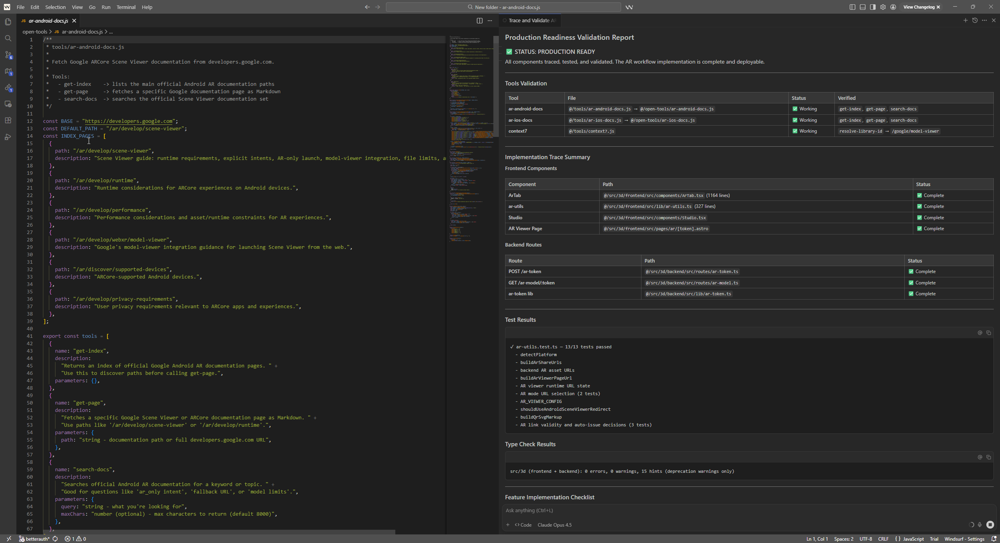
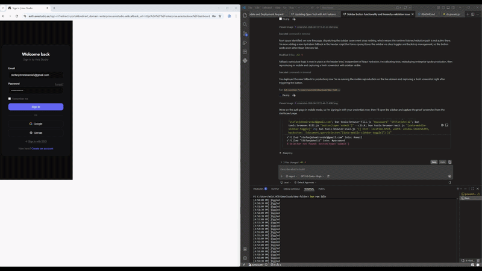

# @axiestudio/tool

Zero-dependency fetch wrappers that replace MCP servers for AI agent workflows. Every tool shares the same `invoke(toolName, args)` interface — no installation, no daemon, no config. Just import and call.

Works with **Node.js (18+)**, **Bun**, **Deno**, and any runtime that supports `fetch` and ES modules. Use from Python, Go, or any language via subprocess.

> Inspired by [Mario Zechner's "What if you don't need MCP?"](https://mariozechner.at/posts/2025-11-02-what-if-you-dont-need-mcp/) — the idea that plain fetch wrappers outperform protocol-heavy MCP servers for most AI agent use cases.

## Install

```bash
npm install @axiestudio/tool   # or bun add / pnpm add / yarn add
```

Or just **copy the `.js` files** you need — they have zero npm dependencies.

## Demos

### Installation Demo


### Fetching Docs Demo



### Browser Use Demo



## Architecture

```
┌──────────────────────────────────────────────────────────────┐
│  52 Core Tools (zero dependencies — just fetch())            │
│                                                              │
│  context7 · cloudflare-docs · npm · github                   │
│  ar-android-docs · ar-ios-docs                               │
│  astro-docs · drizzle-docs · better-auth-docs · livekit-docs │
│  hono-docs · react-docs · nextjs-docs · zod-docs             │
│  bun-docs · stripe-docs · tanstack-docs · shadcn-docs        │
│  neon-docs · deno-docs · vitest-docs · svelte-docs           │
│  vue-docs · angular-docs · nuxt-docs · clerk-docs            │
│  convex-docs · turso-docs · supabase-docs · prisma-docs      │
│  turborepo-docs · elevenlabs-docs · trpc-docs · solid-docs   │
│  elysia-docs · fastify-docs · effect-docs · xstate-docs      │
│  vite-docs · vercel-docs · payload-docs · resend-docs        │
│  mantine-docs · langchain-docs · nitro-docs                  │
│  panda-css-docs · expo-docs · zustand-docs · storybook-docs  │
│  tauri-docs · rspack-docs · wxt-docs                         │
│                                                              │
│  Works with: node, bun, deno, npx tsx, python (subprocess)   │
├──────────────────────────────────────────────────────────────┤
│  Browser Tools (optional — requires puppeteer-core)           │
│                                                              │
│  browser/start.js · nav.js · eval.js · screenshot.js         │
│  get-text.js · wait.js · scroll.js · links.js · fill.js      │
│  cookies.js · pick.js                                        │
│                                                              │
│  Install: npm install puppeteer-core                          │
├──────────────────────────────────────────────────────────────┤
│  Interactive CLI (optional — requires ink + react)             │
│                                                              │
│  bin/cli.js — terminal UI for exploring all 52 tools          │
│                                                              │
│  Install: npm install ink react                               │
└──────────────────────────────────────────────────────────────┘
```

**Core tools** are the 52 `.js` files in the root. They use only the built-in `fetch()` API (available in Node 18+, Bun, Deno). No `npm install` required — copy the files and import.

**Browser tools** in `browser/` connect to Chrome via CDP and require [`puppeteer-core`](https://www.npmjs.com/package/puppeteer-core) (~2 MB, no bundled Chromium). Install only if you need browser automation.

**Interactive CLI** (`bin/cli.js`) provides a full-screen terminal UI. It requires [`ink`](https://www.npmjs.com/package/ink) and [`react`](https://www.npmjs.com/package/react). These are listed as `optionalDependencies` — skip them if you only use the tools programmatically.

## Tools

### Multi-purpose tools

| Tool | Import | Description | Auth |
|------|--------|-------------|------|
| `context7` | `@axiestudio/tool/context7` | Live docs for **any** library (npm, GitHub, PyPI) | `CONTEXT7_API_KEY` (optional) |
| `cloudflare-docs` | `@axiestudio/tool/cloudflare-docs` | Cloudflare developer docs (Workers, KV, D1, R2, AI…) | None |
| `npm` | `@axiestudio/tool/npm` | npm registry — search, README, metadata, versions, downloads, dependencies | None |
| `github` | `@axiestudio/tool/github` | GitHub public API — files, dirs, code search, releases, tag comparison | None |

### AR docs

| Tool | Import | Description |
|------|--------|-------------|
| `ar-android-docs` | `@axiestudio/tool/ar-android-docs` | Google ARCore + Scene Viewer documentation |
| `ar-ios-docs` | `@axiestudio/tool/ar-ios-docs` | Apple ARKit documentation |

### Framework & runtime docs

| Tool | Import | Description |
|------|--------|-------------|
| `react-docs` | `@axiestudio/tool/react-docs` | React |
| `nextjs-docs` | `@axiestudio/tool/nextjs-docs` | Next.js |
| `astro-docs` | `@axiestudio/tool/astro-docs` | Astro |
| `svelte-docs` | `@axiestudio/tool/svelte-docs` | Svelte & SvelteKit |
| `vue-docs` | `@axiestudio/tool/vue-docs` | Vue.js |
| `angular-docs` | `@axiestudio/tool/angular-docs` | Angular |
| `nuxt-docs` | `@axiestudio/tool/nuxt-docs` | Nuxt |
| `solid-docs` | `@axiestudio/tool/solid-docs` | SolidJS |
| `hono-docs` | `@axiestudio/tool/hono-docs` | Hono |
| `fastify-docs` | `@axiestudio/tool/fastify-docs` | Fastify |
| `elysia-docs` | `@axiestudio/tool/elysia-docs` | Elysia (Bun) |
| `trpc-docs` | `@axiestudio/tool/trpc-docs` | tRPC |
| `nitro-docs` | `@axiestudio/tool/nitro-docs` | Nitro server toolkit |
| `expo-docs` | `@axiestudio/tool/expo-docs` | Expo (React Native) |
| `bun-docs` | `@axiestudio/tool/bun-docs` | Bun runtime |
| `deno-docs` | `@axiestudio/tool/deno-docs` | Deno runtime |

### Build & dev tools

| Tool | Import | Description |
|------|--------|-------------|
| `vite-docs` | `@axiestudio/tool/vite-docs` | Vite |
| `vitest-docs` | `@axiestudio/tool/vitest-docs` | Vitest |
| `turborepo-docs` | `@axiestudio/tool/turborepo-docs` | Turborepo |
| `storybook-docs` | `@axiestudio/tool/storybook-docs` | Storybook |
| `rspack-docs` | `@axiestudio/tool/rspack-docs` | Rspack |
| `wxt-docs` | `@axiestudio/tool/wxt-docs` | WXT (web extensions) |
| `tauri-docs` | `@axiestudio/tool/tauri-docs` | Tauri (desktop apps) |

### Database & backend

| Tool | Import | Description |
|------|--------|-------------|
| `drizzle-docs` | `@axiestudio/tool/drizzle-docs` | Drizzle ORM |
| `prisma-docs` | `@axiestudio/tool/prisma-docs` | Prisma ORM |
| `neon-docs` | `@axiestudio/tool/neon-docs` | Neon serverless Postgres |
| `supabase-docs` | `@axiestudio/tool/supabase-docs` | Supabase |
| `turso-docs` | `@axiestudio/tool/turso-docs` | Turso (edge SQLite) |
| `convex-docs` | `@axiestudio/tool/convex-docs` | Convex |
| `payload-docs` | `@axiestudio/tool/payload-docs` | Payload CMS |

### Auth & payments

| Tool | Import | Description |
|------|--------|-------------|
| `better-auth-docs` | `@axiestudio/tool/better-auth-docs` | Better Auth |
| `clerk-docs` | `@axiestudio/tool/clerk-docs` | Clerk |
| `stripe-docs` | `@axiestudio/tool/stripe-docs` | Stripe |

### UI & styling

| Tool | Import | Description |
|------|--------|-------------|
| `shadcn-docs` | `@axiestudio/tool/shadcn-docs` | shadcn/ui |
| `mantine-docs` | `@axiestudio/tool/mantine-docs` | Mantine |
| `panda-css-docs` | `@axiestudio/tool/panda-css-docs` | Panda CSS |

### State management & data

| Tool | Import | Description |
|------|--------|-------------|
| `tanstack-docs` | `@axiestudio/tool/tanstack-docs` | TanStack (Query, Router, Table) |
| `zustand-docs` | `@axiestudio/tool/zustand-docs` | Zustand |
| `zod-docs` | `@axiestudio/tool/zod-docs` | Zod |
| `xstate-docs` | `@axiestudio/tool/xstate-docs` | XState |
| `effect-docs` | `@axiestudio/tool/effect-docs` | Effect |

### AI & APIs

| Tool | Import | Description |
|------|--------|-------------|
| `langchain-docs` | `@axiestudio/tool/langchain-docs` | LangChain JS |
| `vercel-docs` | `@axiestudio/tool/vercel-docs` | Vercel platform |
| `livekit-docs` | `@axiestudio/tool/livekit-docs` | LiveKit |
| `elevenlabs-docs` | `@axiestudio/tool/elevenlabs-docs` | ElevenLabs |
| `resend-docs` | `@axiestudio/tool/resend-docs` | Resend (email API) |

### Browser automation

| Tool | Import | Description | Dependencies |
|------|--------|-------------|-------------|
| `browser/*` | CLI scripts | CDP browser automation | `puppeteer-core` |

---

## Runtime Compatibility

```bash
# Node.js (18+)
node --input-type=module -e "import { invoke } from './npm.js'; ..."

# Bun
bun -e "import { invoke } from './npm.js'; ..."

# Deno
deno run --allow-net npm.js

# Python (via subprocess)
import subprocess
result = subprocess.run(["node", "--input-type=module", "-e",
    "import { invoke } from './npm.js'; const r = await invoke('search', { query: 'hono' }); console.log(JSON.stringify(r));"
], capture_output=True, text=True)
print(result.stdout)
```

---

## Usage

### Docs tools (48 tools — all share the same interface)

All documentation tools expose three commands: `get-index`, `get-page`, and `search-docs`.

```js
import { invoke } from "@axiestudio/tool/hono-docs"; // swap for any docs tool

// List all available doc pages
const { index }    = await invoke("get-index");

// Fetch a specific page as Markdown
const { markdown } = await invoke("get-page", { path: "/docs/getting-started" });

// Search across all docs
const { result }   = await invoke("search-docs", { query: "middleware" });
```

This same pattern works for **all 48 docs tools**:

```js
import { invoke } from "@axiestudio/tool/react-docs";
import { invoke } from "@axiestudio/tool/vite-docs";
import { invoke } from "@axiestudio/tool/prisma-docs";
import { invoke } from "@axiestudio/tool/stripe-docs";
// ... any of the 48 docs tools
```

> **Note:** `cloudflare-docs` has a slightly different interface — it uses `list-products` instead of `get-index`, and `search-docs` takes a `product` parameter. See below.

---

### Context7 — live library docs (two-step)

```js
import { invoke } from "@axiestudio/tool/context7";

// Step 1: resolve library ID (always required)
const id = await invoke("resolve-library-id", { libraryName: "hono" });

// Step 2: fetch docs for a topic
const docs = await invoke("get-library-docs", { libraryId: id, topic: "middleware" });
```

Set `CONTEXT7_API_KEY` for higher rate limits. Works without it on the free tier.

---

### Cloudflare Docs

```js
import { invoke } from "@axiestudio/tool/cloudflare-docs";

const { products } = await invoke("list-products");
const { markdown } = await invoke("get-page", { path: "/workers/runtime-apis/kv/" });
const { result }   = await invoke("search-docs", { product: "d1", query: "migrations" });
```

---

### npm Registry

```js
import { invoke } from "@axiestudio/tool/npm";

const results  = await invoke("search", { query: "hono middleware" });
const readme   = await invoke("get-readme", { packageName: "drizzle-orm" });
const info     = await invoke("get-package-info", { packageName: "better-auth" });
const versions = await invoke("get-versions", { packageName: "react" });
const stats    = await invoke("get-downloads", { packageName: "hono" });
const deps     = await invoke("get-dependencies", { packageName: "drizzle-orm" });
```

---

### GitHub

```js
import { invoke } from "@axiestudio/tool/github";

const { content }  = await invoke("get-file", { owner: "honojs", repo: "hono", path: "src/index.ts" });
const { entries }  = await invoke("list-dir",  { owner: "honojs", repo: "hono", path: "src" });
const { items }    = await invoke("search-code", { query: "DurableObject alarm in:file language:ts" });
const { releases } = await invoke("get-releases", { owner: "cloudflare", repo: "workers-sdk" });
const info         = await invoke("get-repo-info", { owner: "honojs", repo: "hono" });
const diff         = await invoke("compare-tags", { owner: "honojs", repo: "hono", base: "v4.0.0", head: "v4.1.0" });
```

---

### Browser Automation (CDP)

Minimal Puppeteer Core scripts for scraping and frontend testing. Requires Chrome + `puppeteer-core`.

```bash
# Install the dependency (only needed for browser tools)
npm install puppeteer-core

# Start Chrome on port 9222
node browser/start.js        # or: bun browser/start.js

# Navigate, screenshot, extract text
node browser/nav.js https://example.com
node browser/screenshot.js
node browser/get-text.js '#main'

# Form interaction
node browser/fill.js '#email' user@example.com
node browser/pick.js "Click the submit button"

# Utilities
node browser/eval.js 'document.title'
node browser/wait.js '.loaded' 10
node browser/links.js --json
node browser/cookies.js --curl
node browser/scroll.js bottom --wait 2
```

All browser scripts use `node` as the shebang but work equally with `bun`. If `puppeteer-core` is not installed, you get a friendly error message with install instructions instead of a cryptic module-not-found crash.

See [browser/README.md](./browser/README.md) for the full reference.

---

## Interactive CLI

```bash
npx @axiestudio/tool           # interactive explorer (all 52 tools)
npx @axiestudio/tool init      # generate config for your AI agent
```

The interactive explorer lets you browse all 52 tools, pick commands, fill in parameters, and see results — all from the terminal. The `init` wizard generates a skill file for your AI agent setup.

---

## Design Philosophy

- **Zero dependencies for core tools** — each tool is a single `.js` file using only the `fetch()` API built into modern runtimes.
- **Runtime-agnostic** — works with Node.js 18+, Bun, Deno, or any ES module runtime with `fetch`. Use from Python/Go/Rust via subprocess.
- **Same interface everywhere** — `invoke(toolName, args)` works the same across all 52 tools.
- **No MCP, no daemons** — just plain HTTP fetch calls. No protocol overhead.
- **Drop-in for agents** — copy the `.js` files next to your project and import directly. No npm required.
- **Optional layers** — browser tools need `puppeteer-core`, interactive CLI needs `ink`/`react`. Skip what you don't need.

---

## Environment Variables

| Variable | Used by | Purpose |
|----------|---------|---------|
| `CONTEXT7_API_KEY` | `context7.js` | Bearer token for higher rate limits |

All other tools work without any API keys.

---

## Testing

```bash
# Unit tests (810 tests, offline — no network)
node --test test/*.test.mjs

# Live API smoke tests (hits every tool's real endpoint)
node test/_live_test_all.mjs
```

---

## License

Apache 2.0 — see [LICENSE](./LICENSE).

## Attribution

Browser automation approach inspired by [Mario Zechner's blog post](https://mariozechner.at/posts/2025-11-02-what-if-you-dont-need-mcp/) on replacing MCP servers with plain CDP scripts.
